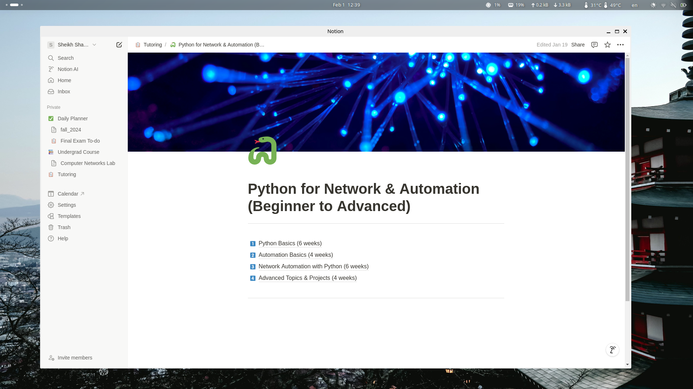

# Notion-Wrapper

This Project aims to install notion as **native desktop app** in linux, since there is **no Offical support** for Linux from Notion



### Setup Instructions

```bash
# Install
chmod +x installer.sh
./installer.sh

# Uninstall
chmod +x uninstaller.sh
./uninstaller.sh
```
